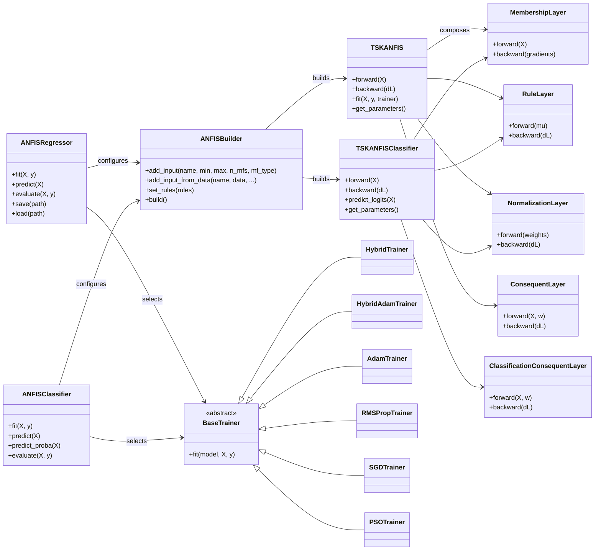

# Developer Guide

Welcome to the ANFIS Toolbox developer guide. This document is intended for
contributors who want to understand the architecture, extend the library, or
work on the documentation and examples. If you are looking for the user-facing
API reference, consult the generated MkDocs site or the module docstrings.

## Project Goals

- Provide a batteries-included Adaptive Neuro-Fuzzy Inference System (ANFIS)
	implementation in Python.
- Offer high-level estimators (`ANFISRegressor`, `ANFISClassifier`) that feel
	familiar to scikit-learn users while remaining dependency-free.
- Support a wide range of membership function families and training regimes.
- Ship with reproducible examples, thorough tests, and easy-to-read docs.

## Repository Layout

```
anfis_toolbox/
├── model.py              # Low-level ANFIS graph (layers, forward passes)
├── regressor.py          # High-level regression estimator facade
├── classifier.py         # High-level classification estimator facade
├── membership.py         # Membership function implementations and helpers
├── builders.py           # Utilities that assemble models from configuration
├── optim/                # Optimizer and trainer implementations
├── metrics.py            # Regression and classification metric utilities
├── losses.py             # Loss definitions shared by optimizers
└── estimator_utils.py    # Mixins, validation helpers, sklearn-like machinery

docs/                     # MkDocs pages and reference material
examples/                 # Notebook-based walkthroughs
tests/                    # Pytest suite with full coverage
```

## High-Level Architecture

1. **Estimators** (`ANFISRegressor`, `ANFISClassifier`) expose a drop-in API
	 with `fit`, `predict`, `predict_proba` (classifier), `evaluate`, and
	 serialization helpers (`save`, `load`). They orchestrate membership
	 generation, rule configuration, optimizer instantiation, and evaluation.
2. **Builders** translate estimator configuration into the low-level model by
	 creating membership functions, calculating rule combinations, and producing
	 an object the trainers can consume.
3. **Low-level model** (`model.ANFIS`, `model.TSKANFISClassifier`) implements
	 the forward pass, rule firing strengths, normalization, and consequent
	 evaluation.
4. **Optimizers** (`optim.*`) encapsulate training strategies such as Hybrid
	 (OLS + gradient descent), Adam, RMSProp, SGD, and PSO. Each trainer accepts a
	 low-level model along with data and optional validation splits.
5. **Utilities** provide common infrastructure: `estimator_utils` for mixins
	 and input validation, `metrics` for reporting, `losses` for objective
	 functions, and `logging_config` for opt-in training logs.

The diagram below illustrates the runtime flow:

```
User code -> ANFISRegressor.fit ------------------------------.
							|                                  |
							v                                  |
				Membership config     Optimizer selection      |
							|                    |             |
							v                    v             |
				builders.ANFISBuilder  optim.<Trainer>         |
							|                    |             |
							'------> model.ANFIS <-------------'
                                                               |
															   v
														 Training loop
```

## Implementation and Architecture

ANFIS Toolbox implements the flow above through a set of small, composable modules. The public estimators in
`anfis_toolbox.regressor` and `anfis_toolbox.classifier` act as façades that translate user-friendly configuration into the
lower-level computational graph defined in `anfis_toolbox.model` and `anfis_toolbox.layers`. Supporting modules such as
`builders`, `config`, `membership`, `losses`, and `optim` provide reusable building blocks that keep concerns separated.

### Core execution pipeline (`anfis_toolbox.model` and `anfis_toolbox.layers`)

- **Fuzzification** sits in `MembershipLayer`, which wraps concrete membership-function objects. The layer caches the raw
	inputs and per-function activations so that the backward pass can recover gradients without re-evaluating membership
	functions.
- **Rule evaluation** is performed by `RuleLayer`. It receives the membership lattice, expands (or filters) the Cartesian
	product of membership indices, and computes rule firing strengths using the configured T-norm (product). The layer also
	propagates derivatives back to the membership layer by reusing the cached activations.
- **Normalization** is handled by `NormalizationLayer`, which performs numerically stable weight normalisation and exposes a
	Jacobian-vector product in its `backward` method so that trainers can work directly with batched gradients.
- **Consequents** are implemented by `ConsequentLayer` (regression) and `ClassificationConsequentLayer` (classification).
	Both layers augment the input batch with biases, compute per-rule linear consequents, and aggregate them using the
	normalised firing strengths. The classification flavour maps the weighted outputs to logits, and integrates with the
	built-in softmax helper in `metrics.py`.
- **Model orchestration** happens in `TSKANFIS` and `TSKANFISClassifier`. Each model wires the layers, exposes forward and
	backward passes, persists gradient buffers, and implements `get_parameters`, `set_parameters`, and `update_parameters` so
	optimizers can operate without needing to understand layer internals.

### Builder and configuration layer (`builders.py`, `config.py`)

- `ANFISBuilder` encapsulates membership-function synthesis. It centralises creation strategies (grid, FCM, random) and maps
	human-readable names (``"gaussian"``, ``"bell"``) to concrete membership classes. The builder also normalises explicit rule
	sets via `set_rules` and exposes a `build()` factory that returns a fully wired `TSKANFIS` instance.
- `ANFISConfig` provides a serialisable description of inputs and training defaults. It can emit builders, write JSON
	configurations, and round-trip through `ANFISModelManager` alongside pickled models. This enables reproducible deployments
	or experiment tracking without shipping raw Python objects.
- Membership families (e.g. `GaussianMF`, `PiMF`, `DiffSigmoidalMF`) live under `membership.py`. Each object exposes a
	`parameters`/`gradients` interface so the layers can mutate them generically during backpropagation.

### Estimator orchestration (`regressor.py`, `classifier.py`, `estimator_utils.py`)

- `ANFISRegressor.fit` and `ANFISClassifier.fit` delegate input validation and reshaping to helpers in `estimator_utils`,
	ensuring NumPy arrays, pandas DataFrames, and Python iterables are handled consistently.
- During fitting, estimators resolve per-input overrides through `_resolve_input_specs`, instantiate an `ANFISBuilder`,
	build the low-level model, select a trainer based on string aliases or explicit objects, and finally call
	`trainer.fit(model, X, y, **kwargs)`. The resulting history dictionary is cached in `training_history_` for downstream
	inspection.
- Persistence relies on the estimator mixins: `save`/`load` methods serialise the estimator and underlying model with
	`pickle`, and `format_estimator_repr` produces concise `__repr__` output that mirrors scikit-learn conventions.
- Logging hooks are opt-in through `logging_config.enable_training_logs`, so verbose fits emit trainer progress while
	remaining silent by default.

### Training infrastructure (`optim/`)

- `BaseTrainer` defines the contract (`fit`, `evaluate`, metric tracking) and shared utilities like batching, progress
	reporting, and validation scheduling.
- Gradient-based trainers (`HybridTrainer`, `HybridAdamTrainer`, `AdamTrainer`, `RMSPropTrainer`, `SGDTrainer`) call the
	model's `forward`, `backward`, `update_parameters`, and `reset_gradients` methods directly. Hybrid variants alternate
	between closed-form least-squares updates for consequents and gradient descent for membership parameters to accelerate
	convergence on regression tasks.
- `PSOTrainer` diverges from gradient descent by optimising consequent coefficients with particle swarm optimisation while
	refreshing membership parameters less aggressively, making it suitable for noisy or non-differentiable objectives.
- All trainers populate a `TrainingHistory` mapping (defined in `optim.base`) that captures per-epoch losses and optional
	validation metrics, facilitating visualisation or early-stopping criteria implemented outside the core package.

### Variants and extension points

- **Regression vs. classification**: `ANFISRegressor` wraps `TSKANFIS`, using mean-squared-error-style losses by default and
	exposing regression metrics. `ANFISClassifier` wraps `TSKANFISClassifier`, instantiates a multi-class consequent layer,
	and defaults to cross-entropy losses with probability calibration via `predict_proba`.
- **Membership variants**: Users can mix automatic generation (`n_mfs`, `mf_type`, `init`, `overlap`, `margin`) with explicit
	`MembershipFunction` instances per feature. Builders preserve the order in which inputs are added so the resulting rule
	indices remain deterministic.
- **Rule customisation**: Providing `rules=[(...)]` to estimators or builders prunes the Cartesian-product rule set. The
	`RuleLayer` validates dimensionality and membership bounds so sparsified rule bases remain consistent.
- **Custom trainers and losses**: Passing a subclass of `BaseTrainer` or a callable `LossFunction` lets advanced users swap
	in bespoke optimisation strategies. Trainers may register additional callbacks or hooks (for example, to integrate with
	`docs/hooks/*` when rendering docs) without patching the core model.
- **Configuration persistence**: `ANFISModelManager` ties trained models to the serialised configuration extracted from the
	membership catalogue, enabling reproducible evaluation environments and lightweight deployment artefacts.

### UML overview



## Working With Estimators

- **Initialization**: Provide global defaults (`n_mfs`, `mf_type`, `init`,
	`overlap`, `margin`) plus optional `inputs_config` overrides for each input.
	`inputs_config` values can be dictionaries with membership parameters or
	explicit `MembershipFunction` instances.
- **Rules**: By default, all membership combinations form rules. Supply
	`rules=[(i1, i2, ...)]` to restrict to a subset of combinations.
- **Optimizers**: Pass `optimizer="adam"` (default classifier) or
	`optimizer="hybrid"` (default regressor). You can also supply instantiated
	trainers or custom subclasses of `BaseTrainer`.
- **Training**: `fit` accepts NumPy arrays, array-like objects, or pandas
	DataFrames. Use `validation_data=(X_val, y_val)` to monitor generalization.
- **Evaluation**: `evaluate` returns a metrics dictionary and optionally prints
	a nicely formatted summary. Use `return_dict=False` to suppress the return
	value.
- **Persistence**: `save` and `load` rely on `pickle`. Saved estimators capture
	fitted membership functions, rules, and optimizer state, enabling reuse.

## Membership Functions

Membership families live in `membership.py`. Key points:

- Each family subclasses `MembershipFunction` and implements `__call__`,
	`derivative`, and metadata accessors.
- Many families accept parameters such as centers, widths, slopes, or plateaus.
- Builders automatically infer parameters using grid spacing, fuzzy C-means
	clustering, or random sampling depending on `init`.
- Provide explicit membership functions via `inputs_config` to lock down
	shapes, e.g.:

	```python
	from anfis_toolbox.membership import GaussianMF

	inputs_config = {
			0: {"membership_functions": [GaussianMF(mean=-1, sigma=0.3), GaussianMF(mean=1, sigma=0.3)]},
			1: 4,  # shorthand for n_mfs=4 using estimator defaults
	}
	```

## Training Strategies

Optimizers live under `anfis_toolbox/optim/` and share a common interface:

- `BaseTrainer.fit(model, X, y, **kwargs)` drives epochs, batching, shuffling,
	and validation.
- Hybrid trainers combine gradient descent with ordinary least squares rule
	consequent updates, delivering fast convergence on regression tasks.
- Adam, RMSProp, and SGD offer familiar gradient-based alternatives.
- PSO provides a population-based search when gradient information is noisy.
- Trainers expose hooks for learning rate, epochs, batch size, shuffle, and
	optional loss overrides.

## Metrics and Evaluation

- `ANFISRegressor.evaluate` reports MSE, RMSE, MAE, and R² via
	`metrics.ANFISMetrics.regression_metrics`.
- `ANFISClassifier.evaluate` reports accuracy, balanced accuracy, macro/micro
	precision/recall/F1, and the confusion matrix.
- Metrics are returned as dictionaries to simplify logging or experiment
	tracking.

## Examples and Documentation

- Explore the `docs/examples/` notebooks for step-by-step tutorials covering
	regression, classification, time series, and membership customization.
- The MkDocs site (`mkdocs.yml`) assembles the `docs/` directory into a hosted
	documentation portal. Run `make docs` to build locally and serve via
	`mkdocs serve`.

## Development Workflow

1. **Install dependencies**: `make install`
2. **Run tests**: `make test`
3. **Lint**: `make lint`
4. **Format (optional)**: `make format`
5. **Docs preview**: `make docs`

Tests cover membership functions, optimizers, estimators, and integration with
scikit-learn-like patterns. New features should include corresponding tests.

## Contributing

- Fork the repository and create a feature branch.
- Keep pull requests focused; tie them to an issue when possible.
- Update or add documentation (including this guide) when behavior changes.
- Ensure `make test` and `make lint` pass before submitting.
- Include demo snippets or notebooks if the feature benefits from examples.

Thanks for contributing to ANFIS Toolbox! If you have questions, open a
discussion or issue on GitHub.
