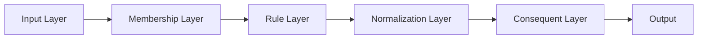

# ANFIS Toolbox

<p align="center">
  
</p>

<p align="center">
    <em>The most user-friendly Python library for Adaptive Neuro-Fuzzy Inference Systems (ANFIS)</em>
</p>

---

**Documentation**: <a href="https://dcruzf.github.io/anfis-toolbox" target="_blank">https://dcruzf.github.io/anfis-toolbox</a>

**Source Code**: <a href="https://github.com/dcruzf/anfis-toolbox" target="_blank">https://github.com/dcruzf/anfis-toolbox</a>

**PyPI**: <a href="https://pypi.org/project/anfis-toolbox" target="_blank">https://pypi.org/project/anfis-toolbox</a>

---

ANFIS Toolbox is a comprehensive Python library for creating, training, and deploying **Adaptive Neuro-Fuzzy Inference Systems (ANFIS)**. It provides an intuitive API that makes fuzzy neural networks accessible to both beginners and experts.

## Key Features

✨ **Easy to Use** - Get started with just 3 lines of code
🏗️ **Flexible Architecture** - 13 membership functions, hybrid learning
📊 **Built-in Visualization** - Automatic plots for training and results
✅ **Robust Validation** - Cross-validation, metrics, model comparison
📚 **Rich Documentation** - Comprehensive examples and tutorials
🔧 **Production Ready** - Model persistence and configuration management

## Quick Example

```python
import numpy as np
from anfis_toolbox import QuickANFIS, quick_evaluate

# 1. Prepare your data
X = np.random.uniform(-2, 2, (100, 2))  # 2 inputs
y = X[:, 0]**2 + X[:, 1]**2  # Target: x1² + x2²

# 2. Create and train model (one line!)
model = QuickANFIS.for_regression(X, n_mfs=3)
losses = model.fit_hybrid(X, y, epochs=50)

# 3. Evaluate and use
metrics = quick_evaluate(model, X, y)
predictions = model.predict([[1.0, -0.5], [0.5, 1.2]])

print(f"R² Score: {metrics['r2']:.4f}")
```

That's it! 🎉 You just created and trained a neuro-fuzzy system!

## Installation

=== "Basic Installation"

    Install the core package with minimal dependencies:

    ```bash
    pip install anfis-toolbox
    ```

=== "Full Installation"

    Install with all features (visualization):

    ```bash
    pip install anfis-toolbox[all]
    ```

## Why ANFIS Toolbox?

### 🚀 Simplicity First

Most fuzzy logic libraries require extensive boilerplate code. ANFIS Toolbox gets you running in seconds:

```python
# Traditional approach (10+ lines)
input_mfs = {
    'x1': [GaussianMF(-1, 1), GaussianMF(1, 1)],
    'x2': [GaussianMF(-1, 1), GaussianMF(1, 1)]
}
model = ANFIS(input_mfs)
# ... manual setup ...

# ANFIS Toolbox approach (1 line)
model = QuickANFIS.for_regression(X)
```

### ✅ Validation Made Easy (Built-in)

Comprehensive model evaluation with minimal code:

```python
from anfis_toolbox import ANFISValidator

validator = ANFISValidator(model)

# Cross-validation
cv_results = validator.cross_validate(X, y, cv=5)
print(f"CV R²: {cv_results['r2_mean']:.4f} ± {cv_results['r2_std']:.4f}")

# Learning curves
learning_data = validator.learning_curve(X, y)
```

## Use Cases

| Application | Description | Code Example |
|-------------|-------------|--------------|
| **Function Approximation** | Learn complex mathematical functions | `QuickANFIS.for_function_approximation([(-π, π)])` |
| **Regression** | Predict continuous values | `QuickANFIS.for_regression(X)` |
| **Control Systems** | Design fuzzy controllers | Custom MF setup for error/error-rate |
| **Time Series** | Forecast future values | Multi-lag input configuration |
| **Pattern Recognition** | Classify with fuzzy boundaries | Post-process regression outputs |

## Architecture

ANFIS Toolbox implements the complete 4-layer ANFIS architecture:



### Supported Membership Functions

- **Gaussian** (`GaussianMF`) - Smooth bell curves
- **Gaussian2** (`Gaussian2MF`) - Two-sided Gaussian with flat region
- **Triangular** (`TriangularMF`) - Simple triangular shapes
- **Trapezoidal** (`TrapezoidalMF`) - Plateau regions
- **Bell-shaped** (`BellMF`) - Generalized bell curves
- **Sigmoidal** (`SigmoidalMF`) - S-shaped transitions
- **Diff-Sigmoidal** (`DiffSigmoidalMF`) - Difference of two sigmoids
- **Prod-Sigmoidal** (`ProdSigmoidalMF`) - Product of two sigmoids
- **S-shaped** (`SShapedMF`) - Smooth S-curve transitions
- **Linear S-shaped** (`LinSShapedMF`) - Piecewise linear S-curve
- **Z-shaped** (`ZShapedMF`) - Smooth Z-curve transitions
- **Linear Z-shaped** (`LinZShapedMF`) - Piecewise linear Z-curve
- **Pi-shaped** (`PiMF`) - Bell with flat top

### Training Methods

- **Hybrid Learning** (recommended) - Combines least squares + backpropagation
- **Pure Backpropagation** - Full gradient-based training
- **Analytical Gradients** - Fast and accurate derivative computation

## What's Next?

- 📖 **[Getting Started](getting-started/installation.md)** - Install and run your first model
- 🎯 **[Quick Start](getting-started/quickstart.md)** - 5-minute tutorial
- 📚 **[User Guide](guide/introduction.md)** - Comprehensive documentation
- 💡 **[Examples](examples/basic.md)** - Real-world use cases
- 🔧 **[API Reference](api/overview.md)** - Complete function documentation
  - 🤖 [ANFIS Models](models/anfis.md) - Regression and classification models
  - 📐 [Membership Functions](api/membership-functions.md) - All MF classes
  - 🔍 [Fuzzy C-Means](models/fuzzy_c-means.md) - Clustering for MF initialization

## Community & Support

- 🐛 **[Report Issues](https://github.com/dcruzf/anfis-toolbox/issues)** - Bug reports and feature requests
- 💬 **[Discussions](https://github.com/dcruzf/anfis-toolbox/discussions)** - Questions and community chat
- 📧 **[Contact](mailto:daniel@ci.ufpb.br)** - Direct contact with maintainers
- ⭐ **[Star on GitHub](https://github.com/dcruzf/anfis-toolbox)** - Show your support!

---

<div align="center">
  <strong>Ready to dive into fuzzy neural networks?</strong><br>
  <a href="getting-started/installation/">Get started now →</a>
</div>
