---
hide:
    - navigation
    - toc
---

<h1 style="text-align:center">ANFIS Toolbox</h1>

<p align="center">
  
</p>

<p align="center">
    <em>The most user-friendly Python library for Adaptive Neuro-Fuzzy Inference Systems (ANFIS)</em>
</p>

---

ANFIS Toolbox is a comprehensive Python library for creating, training, and deploying **Adaptive Neuro-Fuzzy Inference Systems (ANFIS)**. It provides an intuitive API that makes fuzzy neural networks accessible to both beginners and experts.

---

<div style="text-align:center">
    <a href="https://github.com/dcruzf/anfis-toolbox" target="_blank">🔗 <strong>GitHub</strong></a> | <a href="https://pypi.org/project/anfis-toolbox" target="_blank">📦 <strong>PyPI</strong></a>
</div>

---

## Key Features

<div style="display: flex; gap: 1.5rem; flex-wrap: wrap; margin-top: 1rem;">
    <div style="flex: 1; min-width: 280px; padding: 1rem; border: 1px solid #ddd; border-radius: 8px;">
        ✨ <strong>Easy to Use</strong><br>
        Get started with just 3 lines of code
    </div>
    <div style="flex: 1; min-width: 280px; padding: 1rem; border: 1px solid #ddd; border-radius: 8px;">
        🤖 <strong>Versatile Modeling</strong><br>
        Supports both classification and regression tasks
    </div>
    <div style="flex: 1; min-width: 280px; padding: 1rem; border: 1px solid #ddd; border-radius: 8px;">
        🏗️ <strong>Flexible Architecture</strong><br>
        13 membership functions
    </div>
    <div style="flex: 1; min-width: 280px; padding: 1rem; border: 1px solid #ddd; border-radius: 8px;">
        🚀 <strong>Adaptive Initialization</strong><br>
        Fuzzy c-means, grid, and random initialization strategies
    </div>
    <div style="flex: 1; min-width: 280px; padding: 1rem; border: 1px solid #ddd; border-radius: 8px;">
        📉 <strong>Flexible Optimization</strong><br>
        Multiple optimization algorithms
    </div>
    <div style="flex: 1; min-width: 280px; padding: 1rem; border: 1px solid #ddd; border-radius: 8px;">
        📐 <strong>Comprehensive Metrics</strong><br>
        Rich collection of evaluation metrics
    </div>
    <div style="flex: 1; min-width: 280px; padding: 1rem; border: 1px solid #ddd; border-radius: 8px;">
        📚 <strong>Rich Documentation</strong><br>
        Comprehensive examples
    </div>
</div>

## Why ANFIS Toolbox?

### 🚀 Simplicity First

Most fuzzy logic libraries require extensive boilerplate code. ANFIS Toolbox gets you running in seconds:

=== "Regression"

    ```python
    from anfis_toolbox import ANFISRegressor

    model = ANFISRegressor()
    model.fit(X, y)
    ```

=== "Classification"

    ```python
    from anfis_toolbox import ANFISClassifier

    model = ANFISClassifier()
    model.fit(X, y)
    ```


### ⚡ Quick Example

=== "Regression"

    ```python
    import numpy as np
    from anfis_toolbox import ANFISRegressor

    X = np.random.uniform(-2, 2, (100, 2))  # 2 inputs
    y = X[:, 0]**2 + X[:, 1]**2  # Target: x1² + x2²

    model = ANFISRegressor()
    model.fit(X, y)
    ```

=== "Classification"

    ```python
    import numpy as np
    from anfis_toolbox import ANFISClassifier

    X = np.r_[np.random.normal(-1, .3, (50, 2)), np.random.normal(1, .3, (50, 2))]
    y = np.r_[np.zeros(50, int), np.ones(50, int)]

    model = ANFISClassifier()
    model.fit(X, y)
    ```

### 📐 Metrics & Evaluation

Want a structured report instead of a plain dictionary? Use `evaluate` to detect the task type automatically and access every score.

```python
metrics = model.evaluate(X, y)
```

That's it! 🎉 You just created, trained and evaluate a neuro-fuzzy system!


## Installation

Install the core package with minimal dependencies:

```bash
pip install anfis-toolbox
```

## Use Cases

| Application                | Description                             |
| -------------------------- | --------------------------------------- |
| **Function Approximation** | Learn complex mathematical functions    |
| **Regression**             | Predict continuous values               |
| **Classification**         | Predict discrete class labels           |
| **Time Series**            | Forecast future values                  |


## Architecture

ANFIS Toolbox implements the complete 4-layer ANFIS architecture:

```mermaid
flowchart LR

    %% Layer 1
    subgraph L1 [layer 1]
      direction TB
      A1["A1"]
      A2["A2"]
      B1["B1"]
      B2["B2"]
    end

    %% Inputs
    x_input[x] --> A1
    x_input --> A2
    y_input[y] --> B1
    y_input --> B2

    %% Layer 2
    subgraph L2 [layer 2]
      direction TB
      P1((Π))
      P2((Π))
    end
    A1 --> P1
    B1 --> P1
    A2 --> P2
    B2 --> P2

    %% Layer 3
    subgraph L3 [layer 3]
      direction TB
      N1((N))
      N2((N))
    end
    P1 -- w₁ --> N1
    P1 ----> N2
    P2 ----> N1
    P2 -- w₂ --> N2

    %% Layer 4
    subgraph L4 [layer 4]
      direction TB
      L4_1[x y]
      L4_2[x y]
    end
    N1 -- w̅₁ --> L4_1
    N2 -- w̅₂ --> L4_2

    %% Layer 5
    subgraph L5 [layer 5]
      direction TB
      Sum((Σ))
    end
    L4_1 -- "w₁ f₁" --> Sum
    L4_2 -- "w₂ f₂" --> Sum

    %% Output
    Sum -- f --> f_out[f]
```



### Supported Membership Functions

- **Gaussian** (`GaussianMF`) - Smooth bell curves
- **Gaussian2** (`Gaussian2MF`) - Two-sided Gaussian with flat region
- **Triangular** (`TriangularMF`) - Simple triangular shapes
- **Trapezoidal** (`TrapezoidalMF`) - Plateau regions
- **Bell-shaped** (`BellMF`) - Generalized bell curves
- **Sigmoidal** (`SigmoidalMF`) - S-shaped transitions
- **Diff-Sigmoidal** (`DiffSigmoidalMF`) - Difference of two sigmoids
- **Prod-Sigmoidal** (`ProdSigmoidalMF`) - Product of two sigmoids
- **S-shaped** (`SShapedMF`) - Smooth S-curve transitions
- **Linear S-shaped** (`LinSShapedMF`) - Piecewise linear S-curve
- **Z-shaped** (`ZShapedMF`) - Smooth Z-curve transitions
- **Linear Z-shaped** (`LinZShapedMF`) - Piecewise linear Z-curve
- **Pi-shaped** (`PiMF`) - Bell with flat top

### Training Methods

* **SGD (Stochastic Gradient Descent)** – Classic gradient-based optimization with incremental updates
* **Adam** – Adaptive learning rates with momentum for faster convergence
* **RMSProp** – Scales learning rates by recent gradient magnitudes for stable training
* **PSO (Particle Swarm Optimization)** – Population-based global search strategy
* **Hybrid SGD + OLS** – Combines gradient descent with least-squares parameter refinement
* **Hybrid Adam + OLS** – Integrates adaptive optimization with analytical least-squares adjustment


## What's Next?

- 💡 **[Examples](examples/regression_basic.ipynb)** - Real-world use cases
- 🔧 **[API Reference](api/index.md)** - Complete function documentation
- 🤖 **[ANFIS Models](estimators/anfis-regressor.md)** - Regression and classification models
- 📐 **[Membership Functions](membership_functions/gaussian.ipynb)** - All MF classes

## Community & Support

- 🐛 **[Report Issues](https://github.com/dcruzf/anfis-toolbox/issues)** - Bug reports and feature requests
- 💬 **[Discussions](https://github.com/dcruzf/anfis-toolbox/issues)** - Questions and feature requests
- 📘 **[Developer Guide](guide.md)** - Architecture notes and contribution workflow
- ⭐ **[Star on GitHub](https://github.com/dcruzf/anfis-toolbox)** - Show your support!

---

<div align="center">
  <strong>Ready to dive into fuzzy neural networks?</strong><br>
  <a href="#installation">Get started now</a>
</div>
