---
hide:
    - navigation
    - toc
---

<h1 style="text-align:center">ANFIS Toolbox</h1>

<p align="center">
  
</p>

<p align="center">
    <em>The most user-friendly Python library for Adaptive Neuro-Fuzzy Inference Systems (ANFIS)</em>
</p>

---

ANFIS Toolbox is a comprehensive Python library for creating, training, and deploying **Adaptive Neuro-Fuzzy Inference Systems (ANFIS)**. It provides an intuitive API that makes fuzzy neural networks accessible to both beginners and experts.

---

<div style="text-align:center">
    <a href="https://github.com/dcruzf/anfis-toolbox" target="_blank">🔗 <strong>GitHub</strong></a> | <a href="https://pypi.org/project/anfis-toolbox" target="_blank">📦 <strong>PyPI</strong></a>
</div>

---

## Key Features

<div style="display: flex; gap: 1.5rem; flex-wrap: wrap; margin-top: 1rem;">
    <div style="flex: 1; min-width: 280px; padding: 1rem; border: 1px solid #ddd; border-radius: 8px;">
        ✨ <strong>Easy to Use</strong><br>
        Get started with just 3 lines of code
    </div>
    <div style="flex: 1; min-width: 280px; padding: 1rem; border: 1px solid #ddd; border-radius: 8px;">
        🏗️ <strong>Flexible Architecture</strong><br>
        13 membership functions, hybrid learning
    </div>
    <div style="flex: 1; min-width: 280px; padding: 1rem; border: 1px solid #ddd; border-radius: 8px;">
        📊 <strong>Built-in Visualization</strong><br>
        Automatic plots for training and results
    </div>
    <div style="flex: 1; min-width: 280px; padding: 1rem; border: 1px solid #ddd; border-radius: 8px;">
        ✅ <strong>Robust Validation</strong><br>
        Cross-validation, metrics, model comparison
    </div>
    <div style="flex: 1; min-width: 280px; padding: 1rem; border: 1px solid #ddd; border-radius: 8px;">
        📚 <strong>Rich Documentation</strong><br>
        Comprehensive examples and tutorials
    </div>
    <div style="flex: 1; min-width: 280px; padding: 1rem; border: 1px solid #ddd; border-radius: 8px;">
        🔧 <strong>Production Ready</strong><br>
        Model persistence and configuration management
    </div>
</div>

## Why ANFIS Toolbox?

### 🚀 Simplicity First

Most fuzzy logic libraries require extensive boilerplate code. ANFIS Toolbox gets you running in seconds:

```python
# Traditional approach (10+ lines)
input_mfs = {
    'x1': [GaussianMF(-1, 1), GaussianMF(1, 1)],
    'x2': [GaussianMF(-1, 1), GaussianMF(1, 1)]
}
model = ANFIS(input_mfs)
# ... manual setup ...

# ANFIS Toolbox approach (1 line)
model = QuickANFIS.for_regression(X)
```

### ✅ Validation Made Easy (Built-in)

Comprehensive model evaluation with minimal code:

```python
from anfis_toolbox import ANFISValidator

validator = ANFISValidator(model)

# Cross-validation
cv_results = validator.cross_validate(X, y, cv=5)
print(f"CV R²: {cv_results['r2_mean']:.4f} ± {cv_results['r2_std']:.4f}")

# Learning curves
learning_data = validator.learning_curve(X, y)
```


## Quick Example

```python
import numpy as np
from anfis_toolbox import QuickANFIS, quick_evaluate

# 1. Prepare your data
X = np.random.uniform(-2, 2, (100, 2))  # 2 inputs
y = X[:, 0]**2 + X[:, 1]**2  # Target: x1² + x2²

# 2. Create and train model (one line!)
model = QuickANFIS.for_regression(X, n_mfs=3)
losses = model.fit_hybrid(X, y, epochs=50)

# 3. Evaluate and use
metrics = quick_evaluate(model, X, y)
predictions = model.predict([[1.0, -0.5], [0.5, 1.2]])

print(f"R² Score: {metrics['r2']:.4f}")
print(f"RMSE: {metrics['rmse']:.4f}")
```

### Metrics & Evaluation

Want a structured report instead of a plain dictionary? Use `compute_metrics` to detect the task type automatically and access every score via the `MetricReport` helper:

```python
from anfis_toolbox.metrics import compute_metrics

report = compute_metrics(y, y_pred=model.predict(X))
print(report.task)          # "regression"
print(report["mae"])       # individual metric access
print(report.to_dict())     # convert to a plain dict when needed
```

That's it! 🎉 You just created and trained a neuro-fuzzy system!

## Installation

=== "Basic Installation"

    Install the core package with minimal dependencies:

    ```bash
    pip install anfis-toolbox
    ```

=== "Full Installation"

    Install with all features (visualization):

    ```bash
    pip install anfis-toolbox[all]
    ```


## Use Cases

| Application | Description | Code Example |
|-------------|-------------|--------------|
| **Function Approximation** | Learn complex mathematical functions | `QuickANFIS.for_function_approximation([(-π, π)])` |
| **Regression** | Predict continuous values | `QuickANFIS.for_regression(X)` |
| **Control Systems** | Design fuzzy controllers | Custom MF setup for error/error-rate |
| **Time Series** | Forecast future values | Multi-lag input configuration |
| **Pattern Recognition** | Classify with fuzzy boundaries | Post-process regression outputs |

## Architecture

ANFIS Toolbox implements the complete 4-layer ANFIS architecture:

```mermaid
flowchart LR

    %% Layer 1
    subgraph L1 [layer 1]
      direction TB
      A1["A1"]
      A2["A2"]
      B1["B1"]
      B2["B2"]
    end

    %% Inputs
    x_input[x] --> A1
    x_input --> A2
    y_input[y] --> B1
    y_input --> B2

    %% Layer 2
    subgraph L2 [layer 2]
      direction TB
      P1((Π))
      P2((Π))
    end
    A1 --> P1
    B1 --> P1
    A2 --> P2
    B2 --> P2

    %% Layer 3
    subgraph L3 [layer 3]
      direction TB
      N1((N))
      N2((N))
    end
    P1 -- w₁ --> N1
    P1 ----> N2
    P2 ----> N1
    P2 -- w₂ --> N2

    %% Layer 4
    subgraph L4 [layer 4]
      direction TB
      L4_1[x y]
      L4_2[x y]
    end
    N1 -- w̅₁ --> L4_1
    N2 -- w̅₂ --> L4_2

    %% Layer 5
    subgraph L5 [layer 5]
      direction TB
      Sum((Σ))
    end
    L4_1 -- "w₁ f₁" --> Sum
    L4_2 -- "w₂ f₂" --> Sum

    %% Output
    Sum -- f --> f_out[f]
```



### Supported Membership Functions

- **Gaussian** (`GaussianMF`) - Smooth bell curves
- **Gaussian2** (`Gaussian2MF`) - Two-sided Gaussian with flat region
- **Triangular** (`TriangularMF`) - Simple triangular shapes
- **Trapezoidal** (`TrapezoidalMF`) - Plateau regions
- **Bell-shaped** (`BellMF`) - Generalized bell curves
- **Sigmoidal** (`SigmoidalMF`) - S-shaped transitions
- **Diff-Sigmoidal** (`DiffSigmoidalMF`) - Difference of two sigmoids
- **Prod-Sigmoidal** (`ProdSigmoidalMF`) - Product of two sigmoids
- **S-shaped** (`SShapedMF`) - Smooth S-curve transitions
- **Linear S-shaped** (`LinSShapedMF`) - Piecewise linear S-curve
- **Z-shaped** (`ZShapedMF`) - Smooth Z-curve transitions
- **Linear Z-shaped** (`LinZShapedMF`) - Piecewise linear Z-curve
- **Pi-shaped** (`PiMF`) - Bell with flat top

### Training Methods

- **Hybrid Learning** (recommended) - Combines least squares + backpropagation
- **Pure Backpropagation** - Full gradient-based training
- **Analytical Gradients** - Fast and accurate derivative computation

## What's Next?

- 💡 **[Examples](examples/basic.md)** - Real-world use cases
- 🔧 **[API Reference](api/overview.md)** - Complete function documentation
- 🤖 **[ANFIS Models](models/anfis.md)** - Regression and classification models
- 📐 **[Membership Functions](membership_functions/01_gaussianmf.ipynb)** - All MF classes
- 🔍 **[Fuzzy C-Means](models/fuzzy_c-means.md)** - Clustering for MF initialization

## Community & Support

- 🐛 **[Report Issues](https://github.com/dcruzf/anfis-toolbox/issues)** - Bug reports and feature requests
- 💬 **[Discussions](https://github.com/dcruzf/anfis-toolbox/discussions)** - Questions and community chat
- ⭐ **[Star on GitHub](https://github.com/dcruzf/anfis-toolbox)** - Show your support!

---

<div align="center">
  <strong>Ready to dive into fuzzy neural networks?</strong><br>
  <a href="getting-started/installation/">Get started now →</a>
</div>
