# Introduction to ANFIS

**Adaptive Neuro-Fuzzy Inference Systems (ANFIS)** combine the learning capabilities of neural networks with the interpretability of fuzzy logic systems. This powerful hybrid approach makes ANFIS ideal for modeling complex, nonlinear systems where both accuracy and explainability are important.

## What is ANFIS?

ANFIS was introduced by Jang in 1993 as a method to automatically tune fuzzy inference systems using neural network learning algorithms. It represents a **neuro-fuzzy** approach that:

- 🧠 **Learns like a neural network** - Adapts parameters through training data
- 🔀 **Reasons like a fuzzy system** - Uses linguistic rules and membership functions
- 📊 **Combines the best of both worlds** - Accuracy + interpretability

### Core Philosophy

Traditional approaches have limitations:

- **Neural Networks**: Powerful but "black box" - hard to interpret
- **Fuzzy Systems**: Interpretable but require manual tuning
- **ANFIS**: Automatically learns fuzzy rules while maintaining interpretability

## ANFIS Architecture

ANFIS implements a **5-layer feed-forward network** that represents a Sugeno-type fuzzy inference system:

```mermaid
graph LR
    subgraph "Layer 1: Input"
        A1[x₁]
        A2[x₂]
    end

    subgraph "Layer 2: Membership"
        B1[μA₁₁]
        B2[μA₁₂]
        B3[μA₂₁]
        B4[μA₂₂]
    end

    subgraph "Layer 3: Rules"
        C1[w₁]
        C2[w₂]
        C3[w₃]
        C4[w₄]
    end

    subgraph "Layer 4: Normalization"
        D1[w̄₁]
        D2[w̄₂]
        D3[w̄₃]
        D4[w̄₄]
    end

    subgraph "Layer 5: Output"
        E1[Σ]
    end

    A1 --> B1
    A1 --> B2
    A2 --> B3
    A2 --> B4

    B1 --> C1
    B1 --> C2
    B2 --> C3
    B2 --> C4
    B3 --> C1
    B3 --> C3
    B4 --> C2
    B4 --> C4

    C1 --> D1
    C2 --> D2
    C3 --> D3
    C4 --> D4

    D1 --> E1
    D2 --> E1
    D3 --> E1
    D4 --> E1

    style A1 fill:#e3f2fd
    style A2 fill:#e3f2fd
    style E1 fill:#e8f5e8
```



### Layer-by-Layer Breakdown

#### Layer 1: Input Layer
Simply passes input values forward without modification.

- **Function**: Identity mapping
- **Parameters**: None (fixed)
- **Output**: Raw input values x₁, x₂, ..., xₙ

#### Layer 2: Membership Layer
Applies membership functions to convert crisp inputs to fuzzy degrees.

- **Function**: Membership degree calculation
- **Parameters**: MF parameters (centers, widths, shapes)
- **Output**: μAᵢⱼ(x) ∈ [0, 1]
- **Adaptable**: Yes - these parameters are learned

**Example**: For Gaussian membership functions:
```
μ(x) = exp(-½((x - c)/σ)²)
```
Where `c` (center) and `σ` (width) are learned parameters.

#### Layer 3: Rule Layer
Computes the firing strength of each fuzzy rule using T-norm operations.

- **Function**: Rule activation (typically product)
- **Parameters**: None (fixed operation)
- **Output**: wᵢ = μA₁ᵢ(x₁) × μA₂ᵢ(x₂) × ... × μAₙᵢ(xₙ)

#### Layer 4: Normalization Layer
Normalizes rule firing strengths to ensure they sum to 1.

- **Function**: Normalization
- **Parameters**: None (fixed operation)
- **Output**: w̄ᵢ = wᵢ / Σⱼwⱼ

#### Layer 5: Output Layer
Computes final output using weighted sum of consequent functions.

- **Function**: Weighted aggregation
- **Parameters**: Consequent parameters (linear coefficients)
- **Output**: y = Σᵢ w̄ᵢ × fᵢ(x)
- **Adaptable**: Yes - consequent parameters are learned

**Consequent Function**: For Sugeno-type systems:
```
fᵢ(x) = pᵢ₁x₁ + pᵢ₂x₂ + ... + pᵢₙxₙ + qᵢ
```

## Mathematical Foundation

### Forward Pass

The complete ANFIS forward pass can be expressed as:

1. **Membership degrees**: μAᵢⱼ(xⱼ) for each input-MF combination
2. **Rule firing**: wᵢ = ∏ⱼ μAᵢⱼ(xⱼ)
3. **Normalization**: w̄ᵢ = wᵢ / Σₖ wₖ
4. **Output**: y = Σᵢ w̄ᵢ × (pᵢ₁x₁ + ... + pᵢₙxₙ + qᵢ)

### Parameter Learning

ANFIS learns two types of parameters:

**Premise Parameters** (nonlinear):
- Membership function centers, widths, shapes
- Located in Layer 2
- Updated via gradient descent

**Consequent Parameters** (linear):
- Linear coefficients in consequent functions
- Located in Layer 5
- Can be solved analytically using least squares

This dual nature enables **hybrid learning**:
- Forward pass: Least squares estimation for consequent parameters
- Backward pass: Gradient descent for premise parameters

## Types of Fuzzy Systems

ANFIS implements **Sugeno-type** (TSK) fuzzy systems, which differ from Mamdani-type:

### Sugeno-Type (Used by ANFIS)
```
IF x₁ is A₁ AND x₂ is A₂ THEN y = p₁x₁ + p₂x₂ + q
```
- Consequent: Linear function of inputs
- Output: Weighted average of consequent functions
- Advantages: Efficient computation, continuous output, easy parameter learning

### Mamdani-Type (Not used by ANFIS)
```
IF x₁ is A₁ AND x₂ is A₂ THEN y is C
```
- Consequent: Fuzzy set
- Output: Requires defuzzification
- Advantages: More intuitive, linguistically interpretable

## Key Properties

### Universal Approximation
ANFIS can approximate any continuous function on a compact set to arbitrary accuracy, given sufficient rules and appropriate membership functions.

### Interpretability
Unlike neural networks, ANFIS rules can be interpreted:
```
Rule 1: IF temperature is HIGH AND humidity is LOW THEN comfort = 0.8×temp + 0.3×humidity - 2.1
```

### Differentiability
All ANFIS operations are differentiable, enabling gradient-based learning.

### Curse of Dimensionality
Number of rules grows exponentially with inputs:
- 2 inputs × 3 MFs each = 9 rules
- 5 inputs × 3 MFs each = 243 rules
- 10 inputs × 3 MFs each = 59,049 rules

## When to Use ANFIS

### ANFIS is Great For:

✅ **Nonlinear function approximation**
- Complex mathematical functions
- Sensor calibration
- System identification

✅ **Regression with interpretability**
- Need both accuracy AND explanation
- Domain expertise available for rule interpretation
- Regulatory requirements for model transparency

✅ **Control systems**
- Adaptive control
- Fuzzy logic controllers with learning
- Nonlinear control problems

✅ **Time series forecasting**
- Nonlinear temporal patterns
- Multiple input variables
- Need for interpretable predictions

### Consider Alternatives When:

❌ **High-dimensional data** (>5-6 inputs)
- Rule explosion problem
- Consider: Deep learning, ensemble methods

❌ **Large datasets** (>100k samples)
- Training can be slow
- Consider: Gradient boosting, deep learning

❌ **Classification tasks**
- ANFIS is primarily for regression
- Consider: Random forests, SVMs, deep learning

❌ **Pure black-box performance needed**
- No interpretability requirement
- Consider: Deep learning, ensemble methods

## ANFIS vs. Other Methods

| Aspect | ANFIS | Neural Networks | Fuzzy Systems | Linear Regression |
|--------|-------|----------------|---------------|-------------------|
| **Interpretability** | High | Low | High | High |
| **Nonlinearity** | High | High | Medium | Low |
| **Learning** | Automatic | Automatic | Manual | Automatic |
| **Training Speed** | Medium | Fast | N/A | Very Fast |
| **Rule Explosion** | Yes | No | Yes | N/A |
| **Overfitting Risk** | Medium | High | Low | Low |

## Historical Context

### Key Milestones

- **1965**: Fuzzy sets introduced by Zadeh
- **1975**: Mamdani fuzzy inference systems
- **1985**: Sugeno fuzzy inference systems
- **1993**: **ANFIS introduced by Jang** 🎯
- **1995**: Hybrid learning algorithm
- **2000s**: Various extensions and applications
- **2010s**: Integration with modern ML pipelines

### Modern Relevance

ANFIS remains relevant because:

- **Explainable AI**: Growing need for interpretable models
- **Edge Computing**: Lightweight fuzzy models for IoT
- **Hybrid Systems**: Combining fuzzy logic with deep learning
- **Control Systems**: Still preferred for many industrial applications

## Advantages and Limitations

### Advantages ✅

- **Interpretable Rules**: Can understand model decisions
- **Universal Approximation**: Can model any continuous function
- **Hybrid Learning**: Combines analytical and gradient methods
- **Domain Knowledge Integration**: Can incorporate expert knowledge
- **Smooth Output**: Continuous, differentiable predictions

### Limitations ❌

- **Curse of Dimensionality**: Exponential rule growth
- **Local Minima**: Gradient descent can get stuck
- **Initialization Sensitivity**: Results depend on initial MF placement
- **Limited to Regression**: Primarily for continuous outputs
- **Training Time**: Can be slow for large models

## Implementation in ANFIS Toolbox

ANFIS Toolbox implements the complete ANFIS architecture with modern conveniences:

```python
from anfis_toolbox import QuickANFIS

# Easy model creation
model = QuickANFIS.for_regression(X, n_mfs=3)

# Hybrid learning (LSE + gradient descent)
losses = model.fit_hybrid(X, y, epochs=100)

# Rule interpretation
rules = model.get_rules()
for i, rule in enumerate(rules):
    print(f"Rule {i+1}: {rule}")
```

### Supported Features

- ✅ All 6 membership function types
- ✅ Hybrid and pure backpropagation learning
- ✅ Automatic model architecture generation
- ✅ Rule extraction and interpretation
- ✅ Model persistence and deployment
- ✅ Visualization and validation tools

## What's Next?

Now that you understand ANFIS fundamentals:

- 📊 **[Membership Functions](membership-functions.md)** - Learn about different MF types and selection
- 🎯 **[Basic Usage](basic-usage.md)** - Build your first ANFIS model
- 🏗️ **[Model Architecture](model-architecture.md)** - Deep dive into the 5-layer structure
- 📈 **[Training Methods](training-methods.md)** - Master hybrid learning and optimization

---

Ready to build your first ANFIS model? [Start with Basic Usage →](basic-usage.md)
